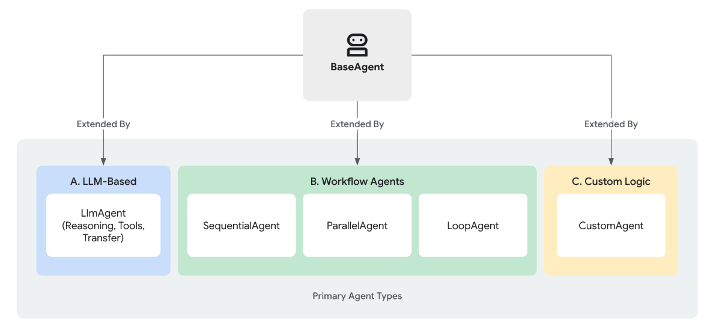
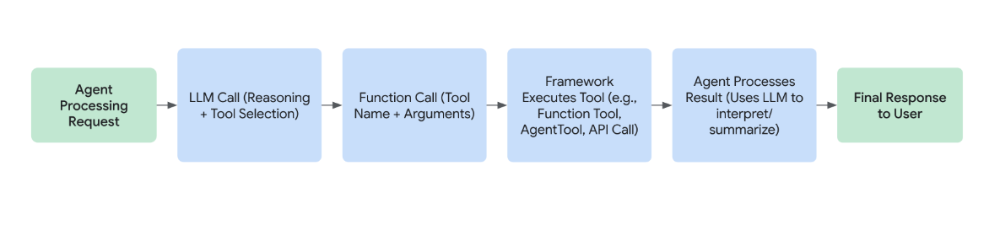
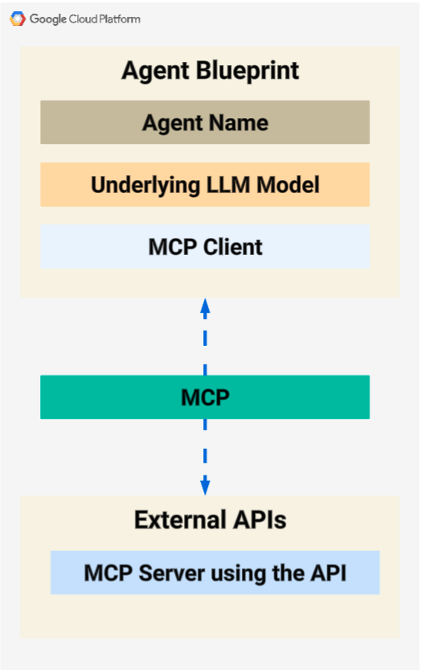
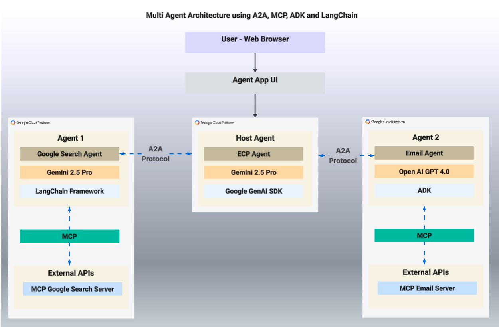

# Agentic AI
Welcome, developers and AI enthusiasts! If you followed Google Next like I did, the word "**AGENT**" must be on top of your mind. 

**Agentic AI** refers to autonomous AI systems that operate proactively, make independent decisions, and execute complex tasks without continuous human intervention.

## Key characteristics:
1. **Autonomous Decision Making** — Reduces human effort by allowing AI to think, reason, and take actions automatically.
2. **Multi-Agent Collaboration** — Allows different AI agents to specialize in tasks, improving accuracy and efficiency.
3. **Scalability & Efficiency** — AI agents execute parallel tasks, reducing processing time compared to traditional workflows.
4. **Enhanced User Experience** — Delivers faster, smarter, and more personalized solutions for complex tasks.

## So, what changes?
There seems to be a significant shift in AI architecture with the announcement of Agent-to-Agent protocols (A2A) by Google, alongside the Model Context Protocol (MCP). The core idea is a move away from explicit programming, which has been the standard for about half a century now.

Explicit programming involves defining every instruction, connection, data flow, and decision point. This leads to deterministic software that can only do exactly what it has been told, limiting its capabilities.

Unlike traditional AI models that require step-by-step commands, Agentic AI works dynamically, making real-time decisions, collaborating with other agents, and optimizing workflows based on contextual data.

## ADK
Reference: https://google.github.io/adk-docs/  
Agent Development Kit (ADK) is a flexible and modular framework for **developing and deploying AI agents**. While optimized for Gemini and the Google ecosystem, ADK is **model-agnostic, deployment-agnostic**, and is built for **compatibility with other frameworks**. ADK was designed to make agent development feel more like software development, to make it easier for developers to create, deploy, and orchestrate agentic architectures that range from simple tasks to complex workflows.

### What is an Agent?
**Agent** is a self-contained execution unit designed to act autonomously to achieve specific goals. Agents can perform tasks, interact with users, utilize external tools, and coordinate with other agents.  
Reference: https://google.github.io/adk-docs/agents/  
  

### What is a Tool?
In the context of ADK, a Tool represents a specific capability provided to an AI agent, enabling it to perform actions and interact with the world beyond its core text generation and reasoning abilities. _What distinguishes capable agents from basic language models is often their effective use of tools._
Reference: https://google.github.io/adk-docs/tools/#what-is-a-tool  
#### Key Characterstics:
- Querying databases
- Making API requests (e.g., fetching weather data, booking systems)
- Searching the web
- Executing code snippets
- Retrieving information from documents (RAG)
- Interacting with other software or services


### How do I get started?
1. ```pip install google-adk```  
2. Follow [ADK Quickstart](https://google.github.io/adk-docs/get-started/quickstart/)  

## MCP
The Model Context Protocol (MCP) is a standardized, open protocol developed by Anthropic that enables AI models to seamlessly interact with external data sources and tools, acting as a universal connector for AI integrations.  
Reference: https://www.anthropic.com/news/model-context-protocol  

## ADK as MCP Client
```
from google.adk.agents.llm_agent import LlmAgent
from google.adk.runners import Runner
from google.adk.sessions import InMemorySessionService
from google.adk.tools.mcp_tool.mcp_toolset import MCPToolset, StdioServerParameters
```


## A2A
An open protocol enabling communication and interoperability between opaque agentic applications. **Google** is driving this open protocol initiative for the industry; this protocol helps support multi-agent communication by giving your agents a common language – irrespective of the framework or vendor they are built on. With A2A, agents can show each other their capabilities and negotiate how they will interact with users (via text, forms, or bidirectional audio/video) – all while working securely together.  
Reference: https://github.com/google/A2A?tab=readme-ov-file#agent2agent-protocol-a2a   

### Core Concepts
1. **Task-based Communication** - Every interaction between agents is treated as a task — a clear unit of work with a defined start and end. This makes communication structured and trackable. 
2. **Agent Discovery** - Agents can automatically discover what other agents do by reading their agent.json file from a standard location
3. **Framework-agnostic Interoperability** - A2A works across different agent frameworks — like ADK, CrewAI, LangChain — so agents built with different tools can still work together.
4. **Multi-modal Messaging** - A2A supports various content types through the Parts system, allowing agents to exchange text, structured data, and files within a unified message format.  
5. **Standardized Message Structure** - A2A uses a clean JSON-RPC style for sending and receiving messages, making implementation consistent and easy to parse.  
6. **Skills and Capabilities** - Agents publish what they can do (“skills”) — along with the inputs they need and outputs they provide — so others know how to work with them. 
7. **Task Lifecycle** - Each task goes through well-defined stages: submitted → working → completed (or failed/canceled). We can always track state a task is in.  
8. **Real-Time Updates (Streaming)** - Long-running tasks can stream updates using Server-Sent Events (SSE), so agents can receive progress in real time.
9. **Push Notifications** - Agents can proactively notify others about task updates using webhooks, with support for secure communication (JWT, OAuth, etc.).
10. **Structured Forms** - Agents can request or submit structured forms using DataPart, which makes handling inputs like JSON or configs easy.

## Multi-Agent Architecture

### Agent Blueprint
A complete agent is depicted in the picture below.  

### Key Characterstics:
1. Uses an underlying LLM
2. Uses MCP to talk to MCP Servers
3. Uses A2A Protocol to talk to other Agents.

### Conceptual Architecture
Here's the concepual architecture of multi-agent app. This architecture depicts use of all options - Gemini and OpenAI models, both ADK and LangChain frameworks. In reality, all the agents in your ecosystem, could just be using say, Gemini as the LLM and ADK as the MCP client.

